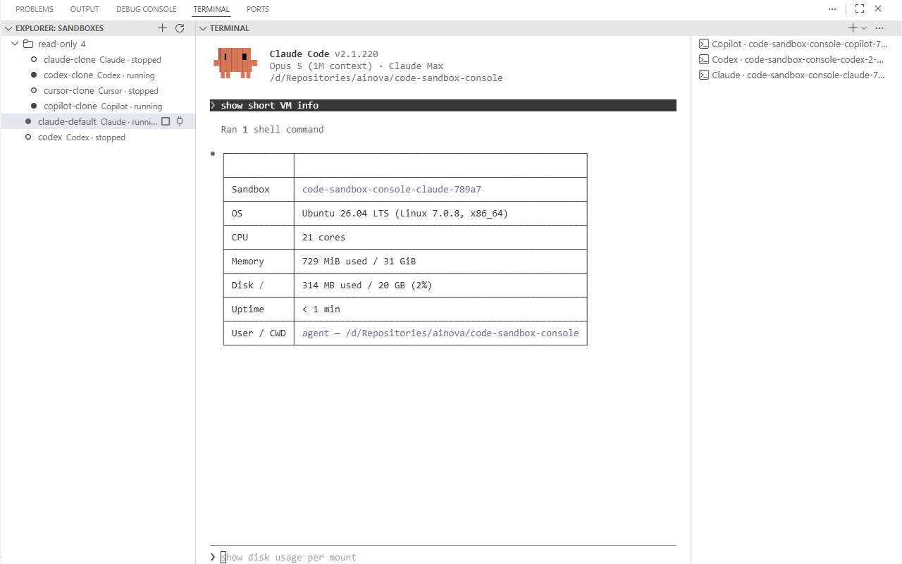

# Sandbox Console

**Run Claude Code, Codex or Gemini inside a real microVM — from a VS Code terminal that feels native.**

[](https://github.com/ainova-systems/code-sandbox-console/actions/workflows/ci.yml)

<!-- TODO(release): uncomment after committing docs/media assets -->
<!--  -->
<!--  -->

- **Isolated** — the agent runs in a Docker Sandbox (`sbx`) microVM, not on your host.
- **Persistent** — stop and resume keeps authentication, installed packages, and history.
- **Zero container management** — one Explorer tree, no YAML by hand, no `docker` commands.

## Install

Search **Sandbox Console** in the VS Code Marketplace, or:

- Quick Open (`Ctrl+P`): `ext install ainova-systems.sandbox-console`
- Terminal: `code --install-extension ainova-systems.sandbox-console`

Then open a repository and run **Sandbox: New Sandbox** (or click `+ New Sandbox` in the
status bar) → pick an agent → **Connect**. A terminal opens with the agent running inside
the sandbox, in your workspace.

## Features

- **Sandboxes view** — an Explorer tree of this repo's sandboxes with live status. Per-node actions
  are state-gated (running → Stop → Edit / Rebuild / Delete instance → Remove from config)
  and can be organised into groups.
- **Status bar & sandbox switcher** — the active sandbox and its state are always visible;
  one click connects. **Switch Sandbox** picks another; the committed recipe
  (`.sandbox/config.yaml`, see Configuration) can mark one `default`.
- **New / Edit form** — a webview panel for agent, title, group, credentials, ports, and
  environment. Saving writes the recipe and applies to the instance.
- **Custom environments** — per sandbox: the agent's default image, a **custom Dockerfile**
  (a starter is generated, then `docker build` → `sbx template load`), or a registry image
  used as-is.
- **Credential provisioning** — tick the services a sandbox needs; values are piped over
  stdin to `sbx secret set` — never written to the repo, an image, or a shell history.
  Per-project values are cached (encrypted for your OS user) so a repo-scoped token is
  entered once, not per sandbox. For `github` the `gh` CLI is authenticated inside too.
- **Generated project CLI** — `.sandbox/scripts/sbx.sh` exposes the same sandbox model
  (status, connect, exec, headless tasks, ephemeral runners, secrets) to shells, scripts,
  and AI skills, so automation never has to re-encode the naming and lifecycle rules.
- **Multi-agent, multi-sandbox** — Claude Code, Codex, Copilot, Cursor, Gemini, OpenCode,
  Droid, Kiro, plain shell, and whatever else your `sbx` reports (the list is discovered
  live). Parallel work on one repo uses git worktrees or `mount: clone`.

## Commands

Command Palette, category **Sandbox**:

| Command | What it does |
| --- | --- |
| `Sandbox: Connect` | Create or attach the active sandbox (resumes if stopped) |
| `Sandbox: Stop` | Stop it, preserving all state |
| `Sandbox: Shell` | Open a plain shell terminal in the sandbox |
| `Sandbox: Rebuild` | Rebuild the custom image / recreate the sandbox |
| `Sandbox: Switch Sandbox` | Pick the active sandbox |
| `Sandbox: New Sandbox` | Open the New Sandbox form |
| `Sandbox: Manage Cached Secrets` | List, rename, delete cached secret entries |
| `Sandbox: Refresh` | Re-run discovery |

Explorer per-node actions: Connect, Stop, Shell, Rebuild, Edit, Delete instance, Remove
from config.

## Requirements

- **VS Code 1.90+**
- **[Docker Sandboxes](https://docs.docker.com/ai/sandboxes/) (`sbx`)**, installed and
  signed in with `sbx login`. Per Docker's documentation it is available for macOS 14+
  (Apple silicon), Windows 11 (x86_64, Windows Hypervisor Platform enabled), and Ubuntu
  24.04+ (KVM); the docs carry no beta or limited-access label, and the CLI is free to use
  including commercially. **Docker Desktop is not required by `sbx` itself.**
- **Docker Engine / Docker Desktop on the host** — only for the *custom Dockerfile* mode,
  which runs `docker build` locally.
- **Workspace Trust** — the extension runs `sbx` commands derived from the workspace's
  committed `.sandbox/config.yaml`, so it stays inert in untrusted and virtual workspaces.
- An account for whichever agent you run (e.g. Claude Code's `/login` inside the sandbox).

Verified against sbx v0.31.3 (2026-07-28), Windows 11.

**Platform support:** developed and verified on **Windows** (`sbx` is resolved from
`%LOCALAPPDATA%\DockerSandboxes\bin`). **macOS and Linux are untested** — `sbx` is taken
from `PATH` and POSIX workspace paths pass through unchanged, so the core flows are
expected to work, but the per-project secret cache is Windows-only (DPAPI) and elsewhere
degrades to prompting for each value. Workspaces on UNC / `\\wsl$` paths are not
supported. Reports welcome.

## Configuration

Sandboxes live in a committed, compose-like recipe written by the form:

```yaml
version: 1
name: my-repo
sandboxes:
  claude:
    agent: claude
    title: Backend
    group: Services
    secrets: [github]
    ports: [5173]
    default: true
  dotnet:
    agent: shell
    image: myrepo-dotnet:latest
    dockerfile: dotnet.Dockerfile   # built and tagged as `image`
```

What the extension writes into your repository — only once you create your first sandbox,
never on merely opening a project:

| Path | Git | Purpose |
| --- | --- | --- |
| `.sandbox/config.yaml` | committed | the shared recipe above |
| `.sandbox/identity.yaml` | gitignored | a short random local id, so clones and worktrees never collide (sandbox name is `<name>-<key>-<id>`) |
| `.sandbox/.gitignore` | committed | keeps the identity out of git |
| `.sandbox/scripts/sbx.sh` | committed | the generated project CLI |

## How it works & security

The extension is a thin orchestration layer over the `sbx` CLI — it does not manage
containers itself. Your workspace is mounted into the microVM automatically, and
credentials are proxied host-side, so a per-sandbox secret is never exposed to another
sandbox's environment (globally scoped credentials are deliberately shared). Secret values
travel only over stdin pipes.

The generated `.sandbox/scripts/sbx.sh` dispatches headless agent tasks with
`claude --dangerously-skip-permissions` — that auto-approval is deliberate and confined to
the isolated sandbox, where the blast radius is the microVM and the mounted workspace, and
it is never used for host-side execution. The extension generates that script but never
executes it.

Security policy and vulnerability reporting:
[SECURITY.md](https://github.com/ainova-systems/code-sandbox-console/blob/main/SECURITY.md).

## Links

- [Features](https://github.com/ainova-systems/code-sandbox-console/blob/main/docs/Features.md)
  and [Architecture](https://github.com/ainova-systems/code-sandbox-console/blob/main/docs/Architecture.md)
- [Iteration specs](https://github.com/ainova-systems/code-sandbox-console/tree/main/docs/specs)
- [Contributing](https://github.com/ainova-systems/code-sandbox-console/blob/main/CONTRIBUTING.md)
  — build, debug, and PR conventions
- [Issues & support](https://github.com/ainova-systems/code-sandbox-console/issues)
- Upstream: [Docker Sandboxes documentation](https://docs.docker.com/ai/sandboxes/)

Licensed MIT. Sandbox Console was designed and implemented by AI coding agents, end to end.

---

© MB Ainova Systems — <https://www.ainovasystems.com>

Docker is a trademark of Docker, Inc. Claude is a trademark of Anthropic, PBC. This
project is independent and is not affiliated with, endorsed by, or sponsored by Docker or
Anthropic.
